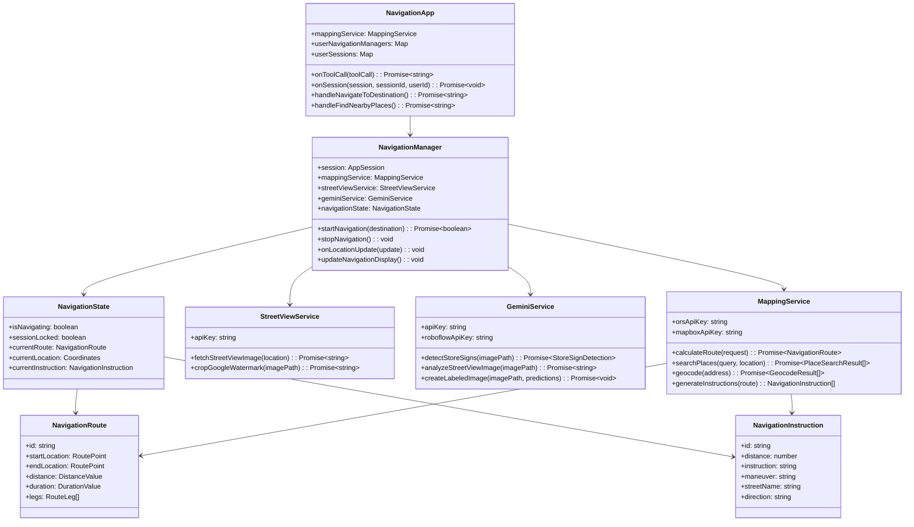

# G(eo)1 - AI-Enhanced Navigation for Smart Glasses

> **G(eo)1** is a play on the G1 glasses but with advanced navigation features, powered by AI and computer vision.

G(eo)1 is a sophisticated navigation system designed specifically for smart glasses, combining real-time GPS navigation with AI-powered environmental analysis and store sign detection. Built on the MentraOS platform, it provides turn-by-turn directions enhanced with contextual awareness of the user's surroundings.

## 🌟 Features

- **🧭 Real-time Navigation**: Turn-by-turn directions with voice guidance
- **🤖 AI Scene Analysis**: Powered by Google Gemini AI for environmental context
- **🏪 Store Sign Detection**: Roboflow-powered computer vision for retail awareness
- **📍 Multi-Provider Mapping**: OpenRouteService, Mapbox, and fallback demo routes
- **🎙️ Voice Control**: Natural voice commands for hands-free operation
- **📱 Smart Glasses Display**: Optimized interface for MentraOS smart glasses
- **🔄 Real-time Updates**: Live location tracking and dynamic route recalculation
- **🎯 Contextual Awareness**: Enhanced navigation with environmental understanding

## 🏗️ System Architecture

### High-Level System Overview


### Component Architecture


### Data Flow Architecture


## 🔄 Navigation Flow

The following sequence diagram illustrates the complete navigation process:


## 🛠️ Technical Architecture

### Core Classes



## 🚀 Technology Stack

### Core Platform
- **[MentraOS SDK](https://mentra.glass)** - Smart glasses platform and hardware abstraction
- **Node.js** - Runtime environment
- **TypeScript** - Programming language

### AI & Computer Vision
- **[Google Gemini AI](https://ai.google.dev/gemini-api)** - Advanced AI for scene analysis and contextual understanding
- **[Roboflow](https://roboflow.com/)** - Computer vision platform for store sign detection
- **Canvas API** - Image processing and manipulation

### Mapping & Navigation
- **[Google Street View Static API](https://developers.google.com/maps/documentation/streetview)** - Street-level imagery
- **[OpenRouteService](https://openrouteservice.org/)** - Primary routing service
- **[Mapbox Directions API](https://docs.mapbox.com/api/navigation/)** - Enhanced routing with turn-by-turn instructions
- **[Nominatim](https://nominatim.openstreetmap.org/)** - Geocoding and place search

### Key Dependencies
```json
{
  "@mentra/sdk": "^2.0.3",
  "axios": "^1.6.0",
  "canvas": "^3.1.2",
  "dotenv": "^17.2.0",
  "express": "^4.18.2"
}
```

## 🎯 Key Features Deep Dive

### 1. AI-Enhanced Navigation
- **Scene Analysis**: Gemini AI analyzes street view images to provide contextual information
- **Store Detection**: Roboflow computer vision identifies and labels store signs
- **Contextual Awareness**: Combines navigation with environmental understanding

### 2. Multi-Provider Route Calculation
- **Primary**: OpenRouteService for free, reliable routing
- **Enhanced**: Mapbox for detailed turn-by-turn instructions
- **Fallback**: Demo routes when APIs are unavailable

### 3. Smart Glasses Optimization
- **Real-time Updates**: 1-second location tracking for responsive navigation
- **Voice Control**: Natural language commands for hands-free operation
- **Optimized Display**: Designed for small screen smart glasses interface

### 4. Advanced Location Services
- **Precision Tracking**: Uses MentraOS location services with multiple accuracy levels
- **Directional Arrows**: Real-time compass-based direction indicators
- **Off-route Detection**: Automatic route recalculation when deviating

## 🔧 Project Structure

```
src/
├── index.ts                 # Main application entry point
├── services/
│   ├── navigationManager.ts # Core navigation logic and state management
│   ├── mappingService.ts    # Route calculation and mapping APIs
│   ├── streetViewService.ts # Google Street View integration
│   └── geminiService.ts     # AI analysis and store sign detection
├── types/
│   └── navigation.ts        # TypeScript type definitions
└── utils/
    ├── distance.ts          # Distance calculations and utilities
    └── instructions.ts      # Navigation instruction processing
```

## 📱 Usage Examples

### Voice Commands
- **"Navigate to Starbucks"** - Find and navigate to nearest location
- **"Navigate to 123 Main Street"** - Navigate to specific address
- **"Find nearby gas stations"** - Search for places around current location
- **"Navigation status"** - Get current navigation information
- **"Cancel navigation"** - Stop current navigation
- **"Restart session"** - Reset for new navigation

### API Integration
```typescript
// Initialize navigation to a destination
const success = await navigationManager.startNavigation("Central Park");

// Get AI analysis of current surroundings
const context = await geminiService.analyzeStreetViewImage(imagePath, location);

// Detect store signs in street view
const detection = await geminiService.detectStoreSigns(imagePath, location);
```

## 🔐 Environment Configuration

Required environment variables:
```env
MENTRAOS_API_KEY=your_mentraos_api_key
GOOGLE_API_KEY=your_google_streetview_api_key
GOOGLE_GEMINI_API_KEY=your_gemini_api_key
ROBOFLOW_API_KEY=your_roboflow_api_key
OPENROUTESERVICE_API_KEY=your_ors_api_key
MAPBOX_API_KEY=your_mapbox_api_key
PACKAGE_NAME=your_package_name
PORT=3000
```

## 🚀 Getting Started

1. **Clone the repository**
   ```bash
   git clone https://github.com/your-repo/mentra-hack-blind-navigation.git
   cd mentra-hack-blind-navigation
   ```

2. **Install dependencies**
   ```bash
   npm install
   ```

3. **Configure environment variables**
   ```bash
   cp .env.example .env
   # Edit .env with your API keys
   ```

4. **Build the project**
   ```bash
   npm run build
   ```

5. **Start the application**
   ```bash
   npm start
   ```

## 🎨 Innovation Highlights

### AI-Powered Context Awareness
G(eo)1 goes beyond traditional navigation by providing intelligent context about your surroundings:
- **Environmental Analysis**: Understands the type of area (commercial, residential, etc.)
- **Store Sign Recognition**: Identifies and reports nearby businesses
- **Contextual Descriptions**: Provides relevant landmarks and navigation aids

### Advanced Computer Vision Pipeline
- **Street View Processing**: Automatically fetches and processes street-level imagery
- **Watermark Removal**: Intelligent cropping to remove Google branding
- **Real-time Detection**: Continuous monitoring of store signs and landmarks
- **Labeled Output**: Generates annotated images with detection results

### Smart Glasses Integration
- **Voice-First Design**: Optimized for hands-free operation
- **Minimal UI**: Clean, focused interface for small displays
- **Real-time Updates**: Responsive navigation with live location tracking
- **Contextual Display**: Shows navigation instructions alongside AI insights

## 📊 Performance Features

- **Real-time Location Tracking**: 1-second update intervals for responsive navigation
- **AI Context Updates**: 20-second intervals for environmental analysis
- **Efficient Route Calculation**: Multi-provider fallback system
- **Optimized Display Updates**: Smooth directional arrow updates
- **Memory Management**: Efficient handling of navigation state and user sessions

## 🔮 Future Enhancements

- **Offline Navigation**: Cached maps and routes for areas without connectivity
- **Enhanced AI Models**: More sophisticated scene understanding and object detection
- **Social Features**: Share routes and points of interest with other users
- **Accessibility Features**: Enhanced support for users with visual impairments
- **Multi-language Support**: Localized voice guidance and interface

## 📄 License

This project is licensed under the MIT License - see the [LICENSE](LICENSE) file for details.

## 🤝 Contributing

We welcome contributions to G(eo)1! Please read our contributing guidelines and submit pull requests for any improvements.

---

**G(eo)1** - Where navigation meets intelligence. Built with ❤️ for the future of smart glasses.